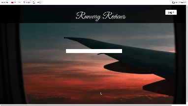

Runway Reviews

## 
 Deployed Link
https://runway-reviews.github.io/runway-reviews-fe/ 
Username: Jeanette Akenja Nearing
Password: $2a$12$0EhXvY8u12yBUdE/QLdkHuzBMQmRTXmJb25FWNSoysvQfk1FVnNUq
To be able to add a review, the user must be logged in. Use the above username and password.

## 💾 Technologies Used

## 👩‍💻 👩‍💻 👨‍💻 👩‍💻 Collaborators
Front-End :
[Emalee Poellot](https://github.com/em2396)  | 
[Zen Mcmillan](https://github.com/zenmcmillan) 

Back-End:
[Justin Lee](https://github.com/JustinSteel) |
[Brendan Bondurant](https://github.com/brendan-bondurant) |
[Blake Sergesketter](https://github.com/bserge13)

## 💭 Abstract
This project allows a user to log into their account and view the reviews they made for a particular airport. They can also add a review of the airport based on a list of categories from a dropdown menu. They can then view the review that was just made. This project uses several different API's to get a list of airports, for the user to login and to show the reviews.

## 📝  Context
We are a group of 2 front-end developers and 3 back-end developers who worked together remotely via Zoom and asynchronously through the GitHub project board to complete this application. This project was completed from week 1 to week 3 in Mod 4 at Turing School of Software & Design. It was our first time using the Vue framework

## 🎥 Preview 

## 🔌 Server Setup
1. Clone the repository: Open a terminal window. Navigate to the directory where you want to clone the repository. Run the following command: git clone 
2. Install the dependencies: Run the following command in the cloned repository directory: npm install
3. Run the React app: Run the following command in the cloned repository directory:
4. 

## 📚 Learning Goals

-Develop a basic understanding of the vue framework

## 🥇 Wins
⭐ Zen: Completing the MVP
⭐ Emalee: Leaning Vue was really fun for me and it felt good to be able to build an app from it

## 🚧 Challenges
❗Zen: Understanding how to pass down props from one component to another
❗ Emalee: Deploying vue was a pain, there were many different ways to do it and it took a long time
